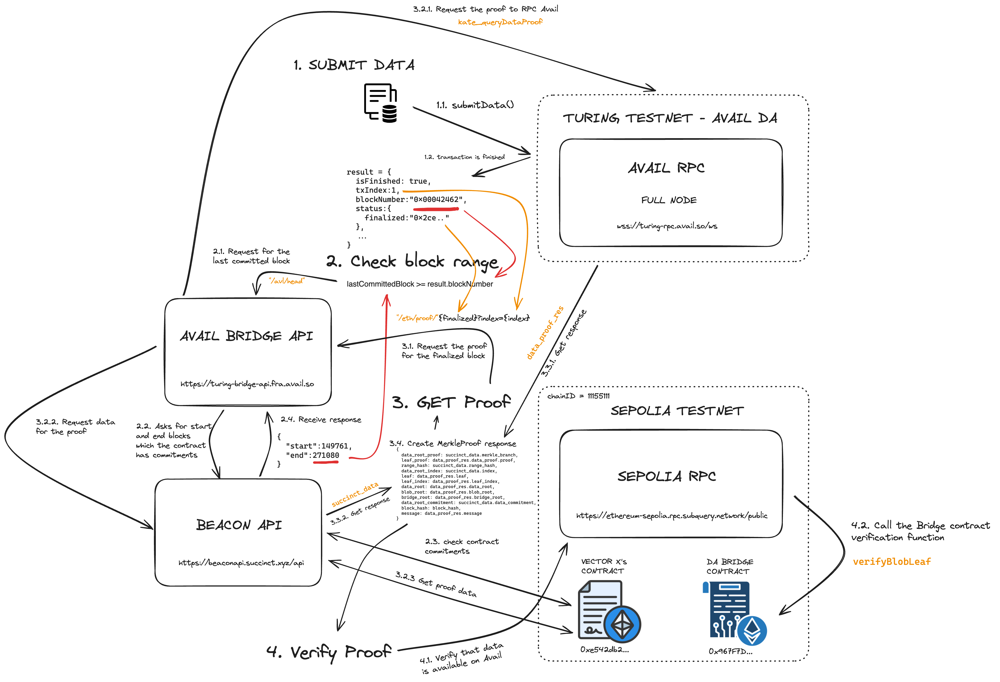

# Validium Deno Script

A Deno script that uses PolkadotSDK to submit data and get proof of its
availability in AvailDA.

Using the [Avail's Bridge API](https://github.com/availproject/bridge-api) (of
[Turing](https://turing-bridge-api.fra.avail.so)) and
[Vector X's contracts](https://github.com/succinctlabs/vectorx?tab=readme-ov-file)
of [Succinct](https://blog.succinct.xyz/vector-x/) with Turing Testnet.

## How it works



## Requirements

- [Deno](https://deno.com/)
- A `.env` file:

```
AVAIL_RPC=wss://turing-rpc.avail.so/ws
SURI='your phrase'
DA_BRIDGE_ADDRESS=0x967F7DdC4ec508462231849AE81eeaa68Ad01389
BRIDGE_API_URL=https://turing-bridge-api.fra.avail.so
ETH_PROVIDER_URL=https://ethereum-sepolia.rpc.subquery.network/public
```

## Run

```sh
deno task validium
```

## What does?

Submit the data to the Turing Testnet DA:

```ts
const result: SubmitDataResult = await submitData(availApi, DATA, account);
```

When finished, make requests to the Bridge API asking for the
[Sepolia block range](https://beaconapi.succinct.xyz/api/integrations/vectorx/range?contractChainId=11155111&contractAddress=0xe542db219a7e2b29c7aeaeace242c9a2cd528f96)
using
[this](https://sepolia.etherscan.io/address/0xe542db219a7e2b29c7aeaeace242c9a2cd528f96)
contract to get the proof of our submitted block.

```ts
const getHeadRsp = await fetch(BRIDGE_API_URL + "/avl/head");
const headRsp = await getHeadRsp.json();
const lastCommittedBlock: number = headRsp.data.end;
if (lastCommittedBlock >= result.blockNumber) {
  // NEXT STEP
} else {
  // Wait one minute and try again
}
```

Once our block is in Sepolia's range. We can get the proof:

```ts
const proofResponse = await fetch(
  BRIDGE_API_URL + "/eth/proof/" + result.status.asFinalized + "?index=" +
    result.txIndex,
);
```

And call the
[Bridge contract verification function](https://docs.availproject.org/docs/build-with-avail/Validium/reference):

```ts
const provider = new ethers.providers.JsonRpcProvider(ETH_PROVIDER_URL);
const contractInstance = new ethers.Contract(BRIDGE_ADDRESS, ABI, provider);
const isVerified = await contractInstance.verifyBlobLeaf([
  proof.dataRootProof,
  proof.leafProof,
  proof.rangeHash,
  proof.dataRootIndex,
  proof.blobRoot,
  proof.bridgeRoot,
  proof.leaf,
  proof.leafIndex,
]);
```

## Testing

```sh
deno task test
```

## Faucet

Use the [Polkadot extension](https://polkadot.js.org/extension/) to manage your
accounts.

You can retrieve AVAIL tokens from [this website](https://faucet.avail.tools/).

## Explorer

You can check the block using [Subscan](https://avail-turing.subscan.io/) or
[Avail Explorer](https://explorer.avail.so).
